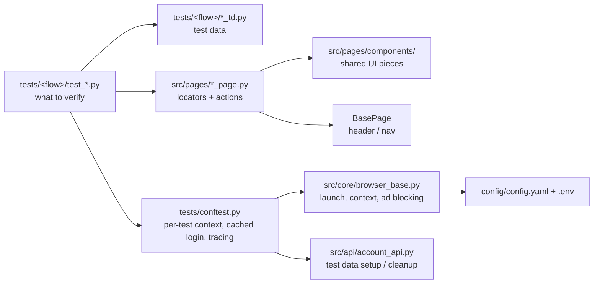

# UI Automation — automationexercise.com

End-to-end UI test automation for [automationexercise.com](https://automationexercise.com), a public e-commerce practice site, built with **Playwright (Python) + pytest** using the **Page Object Model**.

- **58 tests** (48 designed cases) across 9 user flows plus automated accessibility scans, each traced to a row in the [test case matrix](context/ui-test-case-matrix.md)
- **53 passed, 5 xfailed** on Chromium, Firefox and WebKit, running **in parallel** (`-n 4`, ~1.5 min) — the 5 are **real site defects this suite found** (see [Defects found](#defects-found))
- No flaky tests of its own — the only intermittent failures are occasional >15 s page loads on the live site, absorbed by 2 automatic retries. Failures attach a **screenshot + Playwright trace** to the Allure report

## Stack

| | |
|---|---|
| Framework | Playwright (sync API), pytest |
| Pattern | Page Object Model + reusable components, web-first `expect` assertions, API-backed test setup/cleanup |
| Isolation | Fresh browser context per test — safe to run in parallel with `pytest-xdist` |
| Reporting | Allure — step-level actions, per-flow features, failure screenshot + trace |
| CI | GitHub Actions — lint → smoke on every push/PR, full regression nightly on 3 browsers, Allure report with history published to GitHub Pages |
| Browsers | Chromium, Firefox, WebKit (desktop viewport) |
| Accessibility | axe-core WCAG scans of key pages against a known-violations baseline |
| Code quality | ruff (lint + format) via pre-commit and CI, mypy type checking, `--strict-markers` |
| Tooling | Makefile shortcuts, Docker image (official Playwright base), Dependabot |

## Architecture



- **Tests say *what*, page objects say *how*.** Tests contain no selectors; every locator is defined once, in the page object that owns it. Tests assert with Playwright's web-first `expect(...)`, which auto-waits and reports the locator, expected and actual value on failure.
- **Locator strategy:** `get_by_test_id` (the site's `data-qa` attributes) → `get_by_role` / `get_by_text` → CSS ids, in that order of preference.
- **Every page action is an Allure step** (`@allure.step`), so a report reads like the user journey.
- **UI for what's under test, API for everything else.** Throwaway accounts a test needs are created and deleted through the site's public API ([`src/api/account_api.py`](src/api/account_api.py)), so setup is fast and cleanup happens even when a test fails halfway.
- **No secrets in code.** The test account comes from `.env` / CI secrets, loaded once into a `test_user` fixture.

## Setup

```bash
python -m venv .venv && source .venv/bin/activate
pip install -r requirements-dev.txt     # runtime deps + ruff
playwright install --with-deps
pre-commit install                      # ruff lint + format on every commit
cp .env.example .env                    # fill in TEST_EMAIL / TEST_PASSWORD / TEST_USER_NAME for the fixed test account
```

## Running

Common commands are also in the `Makefile` (`make smoke`, `make parallel`, `make lint`, `make typecheck`, `make report`).

```bash
pytest                              # full suite, Chromium, headless
pytest -n auto                      # in parallel, one worker per CPU
pytest --browser=firefox            # another browser (chromium | firefox | webkit)
pytest -m smoke                     # a run tier: smoke | sanity | regression
pytest -m checkout                  # a single flow: nav, login, signup, products, product_details, cart, checkout, contact_us, account
pytest -m accessibility             # axe-core accessibility scans only
pytest --headed                     # watch it in a visible browser window (or HEADED=1)
pytest --reruns 0                   # disable auto-retry (to hunt flaky tests)
```

Or in Docker, with nothing installed but Docker (browsers are in the image):

```bash
docker build -t ui-tests .
docker run --rm --env-file .env ui-tests -m smoke -n 4
```

How a run behaves:

- **Every test is isolated.** Each gets a fresh browser context (cookies, storage, routes and listeners never leak between tests), which is what makes parallel runs and any run order safe.
- **Login happens once** (once per worker under xdist) through the real UI; its storage state is cached and every authenticated test starts from it.
- **Tests clean up after themselves.** Tests that need a new account get one from the `new_account` fixture, which deletes it through the API afterwards — pass or fail. The shared test account is never deleted.
- **Third-party ads are blocked.** Google's full-screen AdSense "vignette" randomly covers the page and swallows clicks — the root cause of an intermittent failure — so ad-network requests are aborted.
- **Failed tests auto-retry twice**; a test that only passes on retry shows as `RERUN` and is worth investigating.
- **Logs** (login caching, API setup/cleanup, saved traces) go to pytest's log output — add `-o log_cli=true` to stream them live.

## Reports and debugging failures

```bash
allure generate reports/allure-results --clean -o reports/allure-report
allure open reports/allure-report
playwright show-trace reports/traces/<test>.zip   # step-by-step replay of a failed test
```

Each failed test carries a full-page screenshot and its Playwright trace (DOM snapshots, network, console) in the Allure report. In CI, every browser's results are merged into one Allure report with run-over-run history and published to GitHub Pages (one-time setup: *Settings → Pages → Deploy from branch → `gh-pages`*). Traces of failed tests are uploaded as build artifacts.

CI needs three repository secrets: `TEST_EMAIL`, `TEST_PASSWORD`, `TEST_USER_NAME`.

## Defects found

Tracked as `xfail(strict=True)`: the suite stays green, but if the site fixes the behavior the test XPASSes and fails the run, so the marker gets removed deliberately.

| Test | Defect | Severity |
|---|---|---|
| `test_checkout_invalid_payment_details_rejected` | Payment accepts a non-numeric card number (`abcd1234`) and places the order | High |
| `test_product_details_quantity_below_minimum_rejected` | Quantity field declares `min="1"`, but `0` is accepted and added to the cart | Medium |
| `test_signup_invalid_mobile_number_format` | Required mobile number accepts `123` and the account is created | Medium |
| `test_products_search_and_filters_keyboard_accessible` | Pressing Enter in product search doesn't submit it (keyboard users) | Low (a11y) |
| `test_login_fields_have_accessible_labels` | Login email input has no `<label>` / `aria-label`, only a placeholder | Low (a11y) |

The axe-core scans (`tests/accessibility/`) found more, recorded as a baseline in `accessibility_td.py` — the build fails if a page gains a new critical/serious violation, **or** loses a known one (so the baseline never goes stale):

| Violation (axe rule) | Where | Impact |
|---|---|---|
| Newsletter `#subscribe` button has no accessible name (`button-name`) | Every page (footer) | Critical |
| File-upload input has no label (`label`) | Contact Us | Critical |
| Quantity input has no label (`label`) | Product details | Critical |
| Carousel prev/next arrows have no text (`link-name`) | Home | Serious |
| Insufficient text colour contrast (`color-contrast`) | Every page | Serious |

Also pinned by a test, for a product decision: `/delete_account` has no server-side auth guard — it renders "Account Deleted!" even when logged out (`test_unauthenticated_access_to_delete_account_not_guarded`).

## Project layout

| Path | Purpose |
|---|---|
| `config/config.yaml` | Environment base URL, viewport, timeouts |
| `src/config/config_loader.py` | Reads `config.yaml` + `.env` overrides (`TEST_ENV`, `BASE_URL`) and the test account |
| `src/api/account_api.py` | Site's account API, for test data setup/cleanup |
| `src/core/browser_base.py` | Browser/context launch, ad blocking, cached-session cookie restore |
| `src/pages/` | One page object per page; `BasePage` holds the shared header/nav and `goto()` (fills URL placeholders like `{product_id}`) |
| `src/pages/components/` | UI pieces shared by several pages (the "Added!" cart modal) |
| `src/utils/accessibility.py` | axe-core scan, attaches the full result to Allure |
| `src/utils/resource_registry.py` | Audit log of created test accounts (`reports/created-resources.jsonl`) |
| `tests/<flow>/test_*.py` | Tests for one user flow |
| `tests/<flow>/*_td.py` | That flow's test data |
| `tests/data/` | Test data files (upload attachments) |
| `conftest.py` | CLI options (`--env`, `--browser`, `--headed`), config, test user, Playwright + API request contexts |
| `tests/conftest.py` | Per-test context/page fixtures, cached login, throwaway accounts, failure artifacts |
| `context/` | Test design: app/auth discovery notes and the traced test case matrix |
| `auth/` | Cached login session (gitignored) |

## Adding a test

1. **New page?** Add `src/pages/<name>_page.py`: subclass `BasePage`, set `URL`, define every locator in `__init__` (prefer `get_by_test_id` → `get_by_role` / `get_by_text` → CSS), and wrap each user action in `@allure.step`. A UI piece shared by several pages goes in `src/pages/components/`.
2. **Add the case to the [matrix](context/ui-test-case-matrix.md)** first — flow, case type, rule, data, expected result.
3. **Write the test** in `tests/<flow>/test_<flow>.py`: no selectors, only page-object calls and web-first `expect(...)` assertions. Put its data in `tests/<flow>/<flow>_td.py`, and name the matrix row in the docstring.
4. **Tag it**: its flow marker, a run tier (`smoke` / `sanity` / `regression`) and a priority (`p0` / `p1`). New markers must be registered in `pyproject.toml` (`--strict-markers`).
5. **Pick the right fixture**: `page` (guest), `authenticated_page` (logged in as the test account), `new_account` (a throwaway account, cleaned up for you), `account_api` (setup that isn't under test).
6. **Found a site bug?** Assert the *correct* behaviour and mark it `xfail(reason="Site defect: …", strict=True)`, then add it to *Defects found*.
7. Run `make lint typecheck` and the flow with `pytest -m <flow> -n auto --reruns 0` before pushing.

## Test design

Cases were designed before any code, per flow, across six case types — happy, negative, boundary, auth-session, visual/a11y, error-display — and deduplicated into [`context/ui-test-case-matrix.md`](context/ui-test-case-matrix.md). Every test's docstring names its matrix row. Where the site's real behavior differed from the design assumption, the test asserts the observed behavior and the matrix records the correction.

## Scope

- **In scope:** browse/search/filter, product details and reviews, cart (add/remove — quantity is only settable on the product page), signup, login/logout, checkout (address → payment → confirmation), account deletion, contact us, and negative/edge/a11y cases for each.
- **Test account:** one fixed, pre-created account reused across runs (credentials via `.env` / CI secrets).
- **Out of scope:** the static `Test Cases`, `API Testing` and `Video Tutorials` pages — covered only by the nav smoke test.
